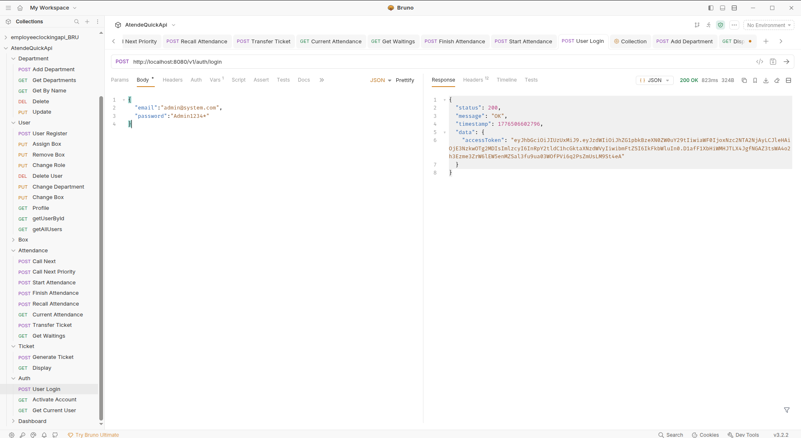
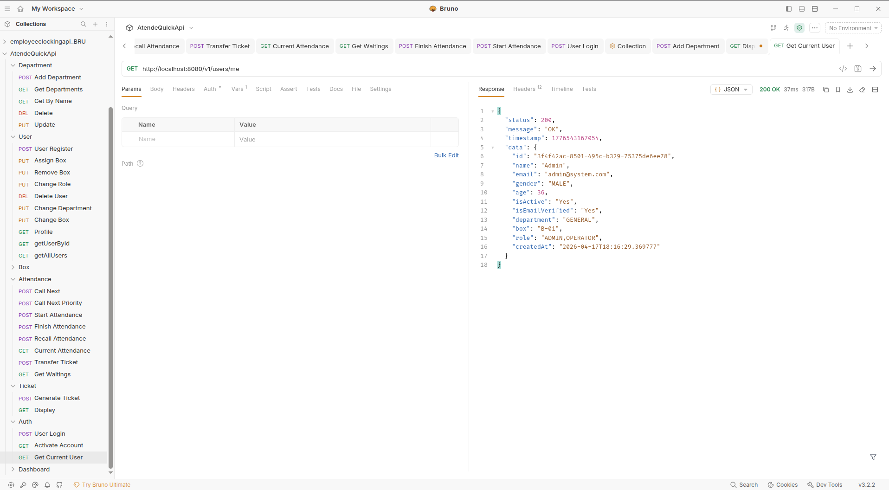
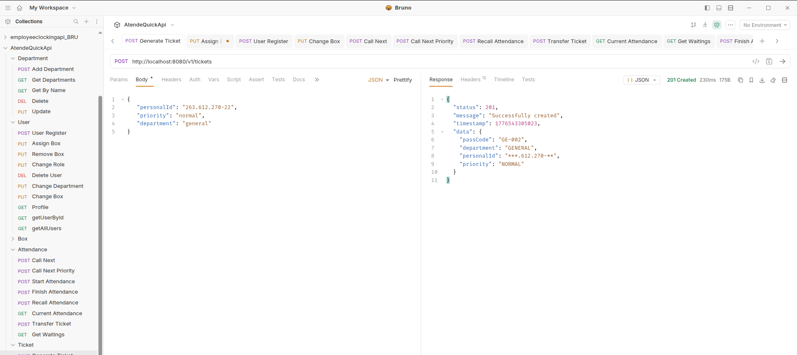
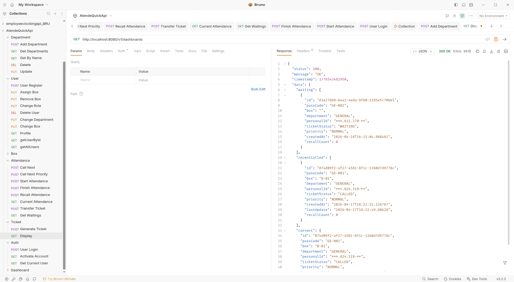
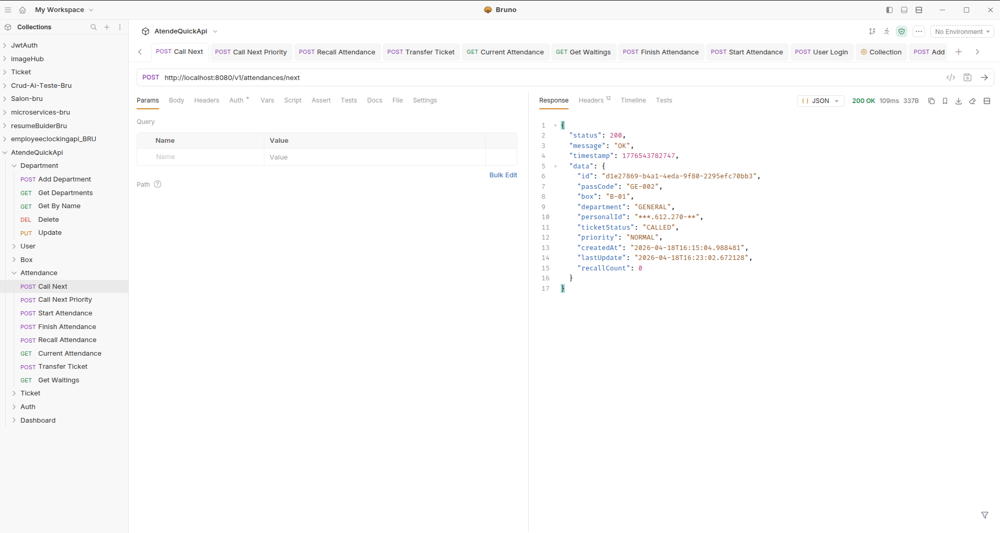
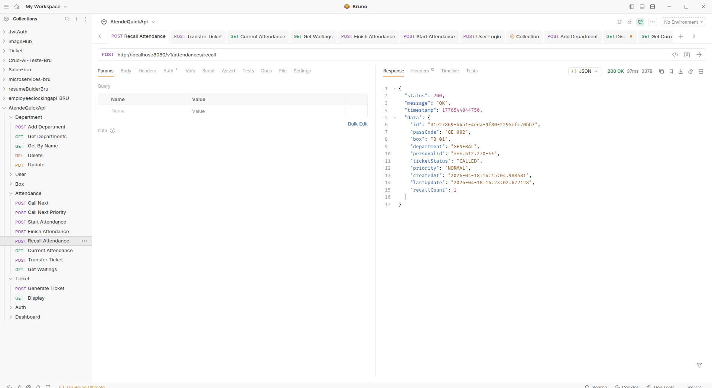
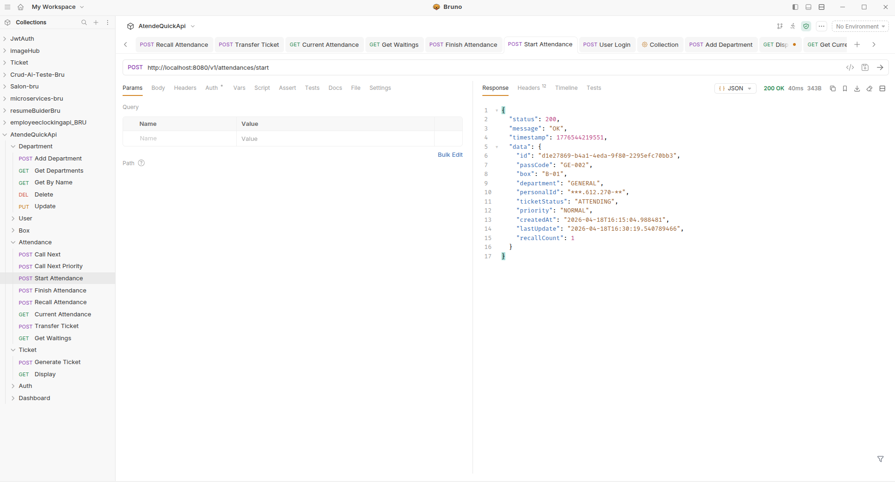
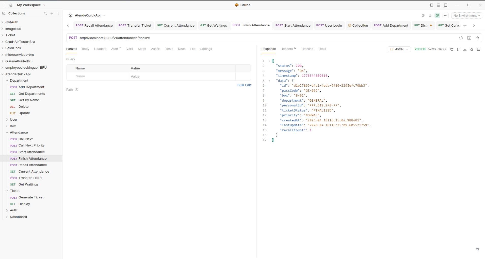

# Attendance Management API

Sistema backend para la gestión de atención de tickets (turnos), diseñado para entornos como bancos, clínicas o centros de atención al cliente.

Permite administrar usuarios, roles, departamentos, cajas de atención y el flujo completo de tickets desde su creación hasta su finalización.

---

## Reglas de negocio

- Un operador solo puede tener un ticket en estado ATTENDING a la vez
- No se puede llamar un nuevo ticket si el operador tiene uno activo
- Los tickets con prioridad PRIORITY tienen preferencia sobre- los NORMAL en la cola
- Los contadores de tickets se reinician automáticamente de forma diaria
- Un ticket puede ser transferido entre departamentos
- Un usuario no puede tener más de un ticket activo por departamento
- Un ticket se cancela automáticamente después de 4 intentos de llamada sin respuesta
- Solo los usuarios con rol ADMIN pueden gestionar usuarios, cajas (Box), departamentos y roles
- Un usuario con rol OPERATOR no puede iniciar atención si no tiene una caja (Box) asignada

---

## Validación de personalId

El sistema utiliza validación sobre el campo `personalId` mediante la anotación `@Cpf`.

Esto implica que el valor debe cumplir con el formato válido de un CPF brasileño:

```bash
000.000.000-00
```

---

### Ejemplo válido

```json
{
  "personalId": "123.456.789-09"
}
```

---

### Ejemplo inválido

```json
{
  "personalId": "12345678909"
}
```

---

### Detalles

- Se valida tanto el **formato** como la **consistencia del CPF**
- Requests con valores inválidos retornarán error `400 Bad Request`
- La validación es automática mediante Bean Validation (Jakarta Validation)

---

### Nota

Esta validación está orientada a usuarios con identificación brasileña.
Si necesitas soportar otros formatos de identificación, deberás implementar validaciones adicionales.

---

## Ciclo de vida del ticket

- Cliente genera ticket → WAITING
- Operador llama ticket → CALLED
- Cliente responde → ATTENDING
- Cliente no responde → CANCELLED
- Atención finalizada → FINALIZED

---

## Características principales

- Autenticación con JWT
- Gestión de usuarios y roles (ADMIN / OPERATOR)
- Verificación de cuenta por email
- Gestión de departamentos
- Gestión de box de atención
- Sistema de tickets con prioridad (NORMAL / PRIORITY) y por departamento (CAJA, EJECUTIVO, ATENCION CLIENTE)
- Reseteo automático diario de contadores de tickets
- Organización por departamentos
- Flujo completo de atención de ticket(WAITING → CALLED → ATTENDING → FINALIZED / CANCELLED)
- Dashboard de atención
- API documentada con Swagger/OpenAPI

---

## Arquitectura

El proyecto sigue una arquitectura en capas:

- **Controller → Service → Repository**
- Separación de responsabilidades
- DTOs para requests y responses
- Mapper para transformación de entidades
- Manejo centralizado de excepciones
- Seguridad con Spring Security

---

## Tecnologías utilizadas

- Java 17
- Spring Boot
- Spring Security
- JWT (JSON Web Token)
- Spring Data JPA
- Hibernate
- PostgreSQL
- Lombok
- Swagger / OpenAPI

---

## Estructura del proyecto

```
src/main/java/com/github/maxiamikel/attendancemanagementapi

├── config
├── controller
├── dto
├── entity
├── enums
├── exception
├── mapper
├── repository
├── security
├── service
├── utils
```

---

## Autenticación

El sistema utiliza autenticación basada en JWT.

### Login

```
POST /v1/auth/login
```

**Request:**

```json
{
  "email": "admin@system.com",
  "password": "Admin1234*"
}
```

**Response:**

```json
{
  "status": 200,
  "message": "OK",
  "timestamp": 1776506602796,
  "data": {
    "accessToken": "JWT_TOKEN"
  }
}
```

---

## Datos iniciales del sistema

Al iniciar la aplicación se crean automáticamente (si no existen):

- Usuario ADMIN
- Roles: ADMIN, OPERATOR
- Departamento: GENERAL
- Caja: B-01

Credenciales por defecto:

```
Email: admin@system.com
Password: Admin1234*
```

---

## Flujo de tickets y cola de atención

Generación de tickets y gestión de cola

El sistema permite la creación de tickets que ingresan automáticamente a una cola de atención organizada por departamento y prioridad

| Acción                  | Endpoint           |
| ----------------------- | ------------------ |
| Generar un nuevo ticket | POST /v1/tickets   |
| Ver la cola de atención | GET /v1/dashboards |

Estados:

```
WAITING -> CALLED -> ATTENDING -> FINALIZED
                  -> CANCELLED
```

### Flujo de atención

| Acción                  | Endpoint                                     |
| ----------------------- | -------------------------------------------- |
| Llamar siguiente ticket | POST /v1/attendances/next                    |
| Llamar por prioridad    | POST /v1/attendances/next-by-priority        |
| Re-llamar ticket        | POST /v1/attendances/recall                  |
| Iniciar atención        | POST /v1/attendances/start                   |
| Finalizar atención      | POST /v1/attendances/finalize                |
| Transferir ticket       | POST /v1/attendances/transfer/{departmentId} |
| Ticket actual           | GET /v1/attendances/current                  |
| Ticket en espera        | GET /v1/attendances/current                  |

---

## Ejecución del proyecto

### 1. Clonar repositorio

```
git clone https://github.com/maxiamikel19/attendancemanagementapi.git
cd attendance-management-api

```

### 2. Configurar base de datos

Editar `application.yml`:

```
spring:
    datasource:
        url: jdbc:postgresql://localhost:5433/database-name
        username: user-name
        password: password
        driver-class-name: org.postgresql.Driver
    mail:
    host: smtp.gmail.com
    port: 587
    username: sender-email
    password: sender-email-password
```

---

### 3. Ejecutar aplicación

```
./mvnw spring-boot:run
```

o

```
mvn spring-boot:run
```

## Ejecutar con docker

```
 docker pull maxiamikel/attendancemanagementapi:latest
 docker run -d -p 8080:8080 --name attendance-api maxiamikel/attendancemanagementapi:latest

```

---

## Documentación Swagger

Disponible en:

```
http://localhost:8080/swagger-ui.html
```

---

## Testing

Puedes usar:

- Postman
- Insomnia
- Swagger UI
- Bruno

---

## Ejemplos live

### Login



### Usuario logado



### Generar nuevo ticket



### Dashboard de atencion



### Llamada del proximo ticket



### Re-call un ticket



### Iniciar atención



### Termina atención



---

## Mejoras futuras

- Paginación en endpoints
- Auditoría (createdAt, updatedAt)
- Soft delete
- Cache (Redis)
- WebSockets para panel en tiempo real
- CI/CD pipeline

---

## Autor

Desarrollado por **Amikel Maxi**

---

## Licencia

Este proyecto está bajo la licencia MIT.
